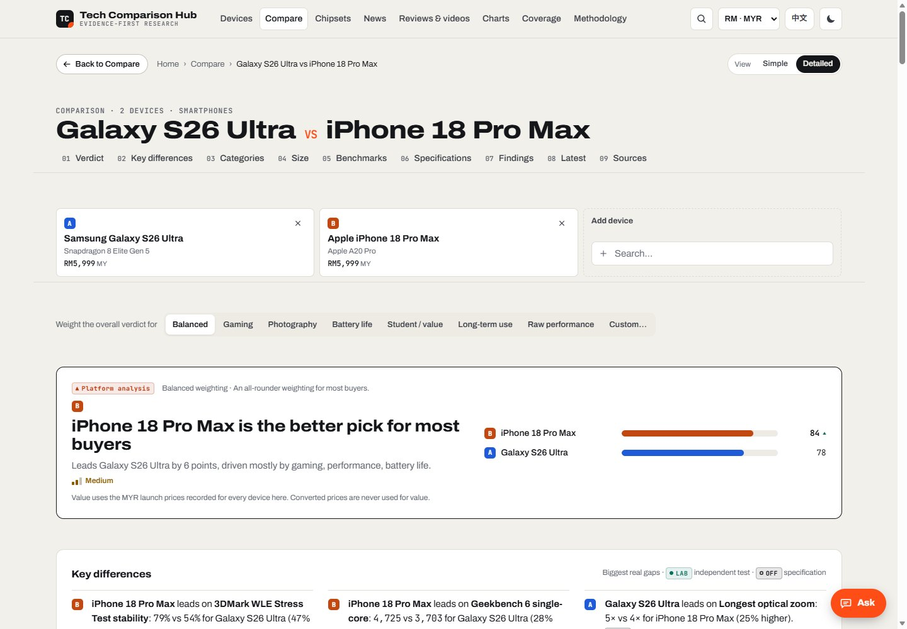

<div align="center">

# Tech Comparison Hub

**Compare phones, tablets, smartwatches, fitness bands and earbuds sold in Malaysia, and see where every number comes from.**

*Official specs, independent lab tests, benchmark databases and reviewer findings, each labelled by source and confidence. In English and 中文.*

[](https://darren38.github.io/tech-comparison-hub/)

<a href="https://darren38.github.io/tech-comparison-hub/"></a>

</div>

## What it is

- **714 devices** (486 phones, 71 tablets, 72 smartwatches, 17 fitness bands, 68 earbuds) and **124 chipsets**: every Samsung, Apple, OPPO, vivo/iQOO, HONOR, Huawei, Xiaomi/Redmi/POCO, realme, OnePlus, Nothing/CMF, Google Pixel, ASUS and REDMAGIC model with a verifiable Malaysian launch since 2023 (including every Apple and Samsung tablet), plus other brands' flagships and the newest China launches (marked as not yet sold in Malaysia and not yet tested).
- **Every value says where it came from**: manufacturer, lab measurement, benchmark database, reviewer, news, estimate or the site's own analysis, with a confidence level. **2,298 attributed evidence records** from 686 source documents and 78 registered sources, plus full specification sheets. Test results for 350 phones come from UL's 3DMark database, AnTuTu, DXOMARK, NanoReview (Geekbench 6 averages), Tom's Guide and Trusted Reviews, and a Samsung phone's Exynos and Snapdragon versions are never mixed.
- **Reviews for the latest flagships**: findings from written reviews, hands-ons, lab tests and YouTube reviews, summarised in the site's own words and credited to each publisher.
- **Charts** of every measured test, flagships first, and generation lines that follow each series model by model. UL 3DMark, DXOMARK and AnTuTu results are **re-checked automatically every morning** (08:05 Malaysia time), Geekbench averages every week, Trusted Reviews' test results are read from each new review, and **new phones join the charts by themselves** once their exact name and chip match a listing; big jumps are held for a person to check. Sections that update by themselves carry a small **Auto** label saying how often.
- **Size, to scale**: real outlines from the makers' published sizes, with the device picture scaled to match and a bank card for scale.
- **Search everything**: devices, chips, headlines, tests, reviews, videos and plain-word explanations of tech terms. A **Simple / Detailed** switch suits newcomers and enthusiasts alike.
- **News sections that keep themselves current**: software updates for iOS and One UI (the newest versions from Apple and Samsung, which Galaxy phones got the latest One UI first and when it reached Malaysia, and problems people report), Apple and Samsung service offers in Malaysia with the region or state they apply to (Samsung's service pages are watched for any free, discount or extended-warranty wording), and flagship chip news.
- **New phones and tablets join by themselves**: when OPPO, HONOR, Huawei, vivo, realme or OnePlus lists a new model on its Malaysian site, Apple adds an iPhone or iPad to Apple Support Malaysia, or Samsung announces a Galaxy on Samsung Newsroom Malaysia (with its Malaysian price), the official page is read and the model is added, labelled **Added automatically** with the maker's page as the source of every value. Makers' spec pages are also re-read every week to fill missing values.
- **Fair comparisons** of up to 4 devices: key differences, category verdicts based only on evidence all of them share, your own weighting, same-test results and a full source list.
- **Prices in Malaysian ringgit**: verified Malaysian launch prices for 538 devices (US dollar, euro and four other currencies available). Converted prices are marked **≈** and never used to score value.
- **Ask the hub**: a built-in assistant that answers from the site's data ("Is it worth buying?", "Does it have NFC?", "Galaxy S26 or iPhone 18 Pro?"). Optionally, an **AI model runs in your own browser** (Qwen3.5 4B or 2B, or the browser's built-in AI): it reads questions in your own words or language, the site's code looks up the answer, and every sentence is checked against the data before it is shown. No question is sent to any AI service.
- **English and Chinese (简体中文)**: switch with EN/中文 in the header. The interface is translated; what sources wrote stays in its own language.
- **Latest headlines** from 23 publications and official newsrooms and 13 YouTube channels in English and Chinese, including Malaysian outlets (SoyaCincau, TechNave, Zing Gadget, Malay Mail), collected live when you press Refresh, with **YouTube view counts** and a Most viewed sort on the Reviews page, and **exchange rates** from Bank Negara Malaysia, refreshed automatically. Ask the hub answers news questions too ("any news about the Galaxy S26?"), including phones not in the database yet.

## How current is it?

| Part | Updated |
|---|---|
| Benchmark databases (UL 3DMark, DXOMARK) and device pictures | Automatically, once a day at 08:05 Malaysia time, for the phones already matched |
| Specs, test results, launch prices, reviewer findings | Checked by hand. **Data as of 25 September 2026**, covering devices announced January 2023 – September 2026 |
| Exchange rates | Automatically, every 3 hours, and again in your browser if the saved rates are not from today |
| Latest headlines | Every 3 hours, and on the spot when you press Refresh |
| The site itself | Every visit checks for newer files, so an update shows on the next refresh |

## Run it locally

Needs Python 3.9 or newer, and nothing else.

```bash
python serve.py --open
```

On Windows you can double-click `start.bat` instead. The **Refresh** button on the News and Reviews pages collects headlines on the spot: locally through the server, and on the published site through a small relay (see [docs/DEPLOYMENT.md](docs/DEPLOYMENT.md)). The optional AI answers need a recent Chrome or Edge with WebGPU.

## Contributing

All the data is plain JSON in `data/`. See [CONTRIBUTING.md](CONTRIBUTING.md) for adding devices, evidence, prices and pictures. Check your changes with `python tools/build.py --check --strict`.

Further reading: [how scoring and confidence work](docs/METHODOLOGY.md) · [data model](docs/DATA_MODEL.md) · [architecture](docs/ARCHITECTURE.md) · [deployment](docs/DEPLOYMENT.md) · [changelog](CHANGELOG.md)

## Credits and licence

The code is under the [MIT licence](LICENSE). Facts are credited to the sources they came from, with links. Reviewer findings are short summaries in this project's own words. Device pictures are the makers' official product images or Wikimedia Commons files under their own free licences, credited on each device page; they load from their owners' servers. Headlines belong to their publishers and link to the original articles. The optional AI models (Qwen3.5, Apache 2.0) are downloaded by each visitor's browser from Hugging Face.
